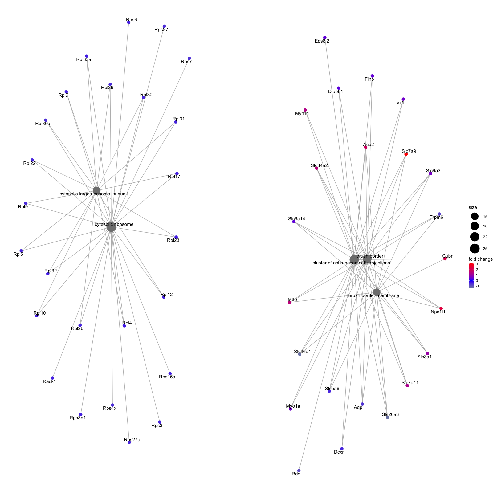

```{r setup, include=FALSE}
knitr::opts_chunk$set(echo = TRUE)
```

## Library loading and set up
```{r}
suppressMessages(
  c(library(DESeq2),
    library(tximport),
    library(gridExtra),
    library(ensembldb),
    library(EnsDb.Mmusculus.v79),
    library(grid),
    library(ggplot2),
    library(lattice),
    library(reshape),
    library(mixOmics),
    library(gplots),
    library(RColorBrewer),
    library(readr),
    library(dplyr),
    library(VennDiagram),
    library(clusterProfiler),
    library(DOSE),
    library(org.Mm.eg.db), 
    library(pathview),
    library(AnnotationDbi),
    library(gtools),
    library(tidyr),
    library(apeglm))
)
```

## Compile gene count file in DESeq2

Gene count matrix is from Xiaoyi Li at the Ventura lab from MSKCC. 

Experimennt:
 - Tissue samples from T6B and control mice with systemic Dox treatment were harvested for the RNA-Seq. 
 - Expression of T6B in tissue were validated to disrupt RISC assembly. Functionally knocking out miRNA functions.

```{r}
count_matrix <- read_csv("Data/t6b-counts-all-vM22.csv")
gene_names<- data.frame(do.call('rbind', strsplit(as.character(count_matrix$genes),'.',fixed=TRUE)))
count_matrix <- as.matrix(count_matrix[,-1])
rownames(count_matrix) <- gene_names$X1

count_matrix_colon <- count_matrix[,c(1,5,9,13,17,21)]

DESeqsampletable <- data.frame(condition = c('control','control','control','T6B','T6B','T6B'))

rownames(DESeqsampletable) <- colnames(count_matrix_colon)

ddsHTSeq<- DESeqDataSetFromMatrix(count_matrix_colon, DESeqsampletable, ~ condition)

ddsHTSeq_norm <- DESeq(ddsHTSeq)
ddsHTSeq_analysis <- lfcShrink(ddsHTSeq_norm, coef = "condition_T6B_vs_control", type = "apeglm")

```
MA plot was generated to inspect the correct shrinkage of LFC.
```{r}
DESeq2::plotMA(ddsHTSeq_analysis)
```

## Quality Inspection of the Gene Count Data
### Generate raw count table that contains the simple counts of each gene
Data is transformed and pseudocount is calculated.
```{r}
rawCountTable <- as.data.frame(DESeq2::counts(ddsHTSeq_norm, normalize = TRUE))
pseudoCount = log2(rawCountTable + 1)
grid.arrange(
  ggplot(pseudoCount, aes(x= ctl1colon)) + xlab(expression(log[2](count + 1))) + ylab("Number of Genes") + 
    geom_histogram(colour = "white", fill = "#525252", binwidth = 0.6) + labs(title = "Control_1"), 
  ggplot(pseudoCount, aes(x= ctl2colon)) + xlab(expression(log[2](count + 1))) + ylab("Number of Genes") + 
    geom_histogram(colour = "white", fill = "#525252", binwidth = 0.6) + labs(title = "Control_2"),
  ggplot(pseudoCount, aes(x= ctl3colon)) + xlab(expression(log[2](count + 1))) + ylab("Number of Genes") + 
    geom_histogram(colour = "white", fill = "#525252", binwidth = 0.6) + labs(title = "Control_3"),
  ggplot(pseudoCount, aes(x= t6b1colon)) + xlab(expression(log[2](count + 1))) + ylab("Number of Genes") + 
    geom_histogram(colour = "white", fill = "#525252", binwidth = 0.6) + labs(title = "T6B_1"),
  ggplot(pseudoCount, aes(x= t6b2colon)) + xlab(expression(log[2](count + 1))) + ylab("Number of Genes") + 
    geom_histogram(colour = "white", fill = "#525252", binwidth = 0.6) + labs(title = "T6B_2"),
  ggplot(pseudoCount, aes(x= t6b3colon)) + xlab(expression(log[2](count + 1))) + ylab("Number of Genes") + 
    geom_histogram(colour = "white", fill = "#525252", binwidth = 0.6) + labs(title = "T6B_3"), nrow = 2)
```

### Between-sample distribution
Check on the gene count distribution across all genes.
```{r}
#Boxplots
suppressMessages(df <- melt(pseudoCount, variable_name = "Samples"))
df <- data.frame(df, Condition = substr(df$Samples,1,3))

ggplot(df, aes(x=Samples, y=value, fill = Condition)) + geom_boxplot() + xlab("") + 
  ylab(expression(log[2](count+1))) + scale_fill_manual(values = c("#619CFF", "#F564E3")) + theme(axis.text.x = element_text(angle = 90, hjust = 1))

#Histograms and density plots
ggplot(df, aes(x=value, colour = Samples, fill = Samples)) + ylim(c(0, 0.25)) + 
  geom_density(alpha = 0.2, size = 1.25) + facet_wrap(~ Condition) +
  theme(legend.position = "top") + xlab(expression(log[2](count+1)))
```

### Clustering of the sample-to-sample distances
This is the sanity check step to confirm that under a un-supervised clustering, WT and G12D samples will cluster together. For some reason, the code is giving error when try to plot this heatmap in RStudio, so I created a pdf file that contains the heatmap in the Analysis folder named `Hierchical Clustering.pdf`
```{r}
ddsHTSeq_transform <- varianceStabilizingTransformation(ddsHTSeq_norm)
rawCountTable_transform <- as.data.frame(assay(ddsHTSeq_transform))
pseudoCount_transform = log2(rawCountTable_transform + 1)
mat.dist = pseudoCount_transform
mat.dist = as.matrix(dist(t(mat.dist)))
mat.dist = mat.dist/max(mat.dist)
png('Figure/Hierchical_Clustering.png')
cim(mat.dist, symkey = FALSE, margins = c(6, 6))
suppressMessages(dev.off())
```

Final output is following:


### Principal component plot of the samples
I performed PCA analysis on all datasets to confirm that samples from the same condition group together. This step has to be performed using `varianceStabelizingTransformed` dataset, so that the high variance in genes with low counts will not skew the data.

The top 500 most variable genes are selected for PCA analysis.

```{r}
plotPCA(ddsHTSeq_transform, intgroup = "condition", ntop = 500)
```

# Raw data filtering and Generate the raw count file with all detected genes
This step removes all genes with 0 counts across all samples, output a `csv` file and also generate a density plot using filtered dataset.
```{r}
rawCountTable_no_normalization <- as.data.frame(DESeq2::counts(ddsHTSeq))
keep <- rowMeans(rawCountTable[,1:3]) > 50 | rowMeans(rawCountTable[,4:6]) > 50
filterCount <- pseudoCount[keep,]
df <- melt(filterCount, variable_name = "Samples")
df <- data.frame(df, Condition = substr(df$Samples,1,3))
detected_raw_count_norm <- rawCountTable[keep,]
write.csv(detected_raw_count_norm, "Result/normalized_raw_gene_counts.csv")
rawCountTable_no_normalization <- rawCountTable_no_normalization[keep,]
write.csv(rawCountTable_no_normalization, "Result/raw_gene_counts.csv")


ggplot(df, aes(x=value, colour = Samples, fill = Samples)) + 
  geom_density(alpha = 0.2, size = 1.25) + facet_wrap(~ Condition) +
  theme(legend.position = "top") + xlab("pseudocounts")
```  

### Generate file with differential analysis result
This step generates the analysis file that contains results from differential analysis.
```{r}
write.csv(as.data.frame(ddsHTSeq_analysis[keep,]), "Result/Differential Analysis.csv")
```

### Draw heatmap for transcripts that are significantly dysregulated in T6B samples
Genes that were not detected were removed from the list. Genes with `padj` < 0.05 were considered significantly dysregulated. Their normalized counts were z-scored and used for plotting the heatmap.

```{r}
suppressMessages(library(mosaic))

rawCountTable_transform_detected <- rawCountTable_transform[keep,]

dif_analysis <- as.data.frame(ddsHTSeq_analysis)[keep,]
sig_dif <- subset(dif_analysis, dif_analysis$padj < 0.05)
sig_index <- c()
for (i in 1:dim(sig_dif)[1]) {
  sig_index <- c(sig_index ,grep(rownames(sig_dif)[i], rownames(rawCountTable_transform_detected)))
}
sig_count <- rawCountTable_transform_detected[sig_index,]
sig_dif <- cbind(sig_dif, sig_count)
for (i in 1:dim(sig_dif)[1]) {
  sig_dif[i,6:11] <- zscore(as.numeric(sig_dif[i,6:11]))
}

my_palette <- colorRampPalette(c("blue", "white", "red"))(256)
heatmap_matrix <- as.matrix(sig_dif[,6:11])

png('Figure/T6B vs control colon RNASeq.png',
    width = 600,
    height = 1400,
    res = 200,
    pointsize = 8)
par(cex.main=1.1)
heatmap.2(heatmap_matrix,
          main = "Differentially expressed\nRNA in T6B colon\npadj < 0.05",
          density.info = "none",
          key = TRUE,
          lwid = c(3,7),
          lhei = c(1,7),
          col=my_palette,
          margins = c(12,2),
          symbreaks = TRUE,
          trace = "none",
          dendrogram = "row",
          labRow = FALSE,
          ylab = "Genes",
          cexCol = 2,
          Colv = "NA")
dev.off()
```

Final output is 

### Scatter plot, MA plot and Volcano plot for data visualization

```{r}
# Scatter plot
detected_pseudocount <- pseudoCount[keep,]
dif_analysis$T6B_mean <- rowMeans(detected_pseudocount[,4:6])
dif_analysis$control_mean <- rowMeans(detected_pseudocount[,1:3])
ggplot(dif_analysis, aes(x = control_mean, y = T6B_mean)) +
  xlab("control_Average(log2)") + ylab("T6B_Average(log2)") + 
  geom_point(data = dif_analysis, alpha = 0.5, size = 1, color = "grey") +
  geom_point(data = subset(dif_analysis, padj < 0.05 & log2FoldChange > 0), alpha = 0.5, size = 1, color = "red") +
  geom_point(data = subset(dif_analysis, padj < 0.05 & log2FoldChange < 0), alpha = 0.5, size = 1, color = "blue") +
  labs(title = "T6B vs control Scatter Plot")

# MA plot
ggplot(dif_analysis, aes(x = log(baseMean,2), y = log2FoldChange,)) +
  xlab("Average Expression") + ylab("LFC") + 
  geom_point(data = dif_analysis, alpha = 0.5, size = 1, color = "grey") +
  geom_point(data = subset(dif_analysis, padj < 0.05 & log2FoldChange > 0), alpha = 0.5, size = 1, color = "red") +
  geom_point(data = subset(dif_analysis, padj < 0.05 & log2FoldChange < 0), alpha = 0.5, size = 1, color = "blue") +
labs(title = "T6B vs control MA Plot")

# Volcano Plot
ggplot(dif_analysis, aes(x = log2FoldChange, y = -log(padj,10))) +
  xlab("LFC") + ylab("-log10(P value)") + 
  geom_point(data = dif_analysis, alpha = 0.5, size = 1, color = "black") +
  geom_point(data = subset(dif_analysis, padj < 0.05 & log2FoldChange > 0), alpha = 0.5, size = 1, color = "red") +
  geom_point(data = subset(dif_analysis, padj < 0.05 & log2FoldChange < 0), alpha = 0.5, size = 1, color = "blue") +
labs(title = "T6B vs control Volcano Plot") +
  xlim(-3,3) + ylim(0,20)


```

### GO analysis for DE genes
Classic GO analysis is performed here for all DE genes detected in this dataset. The reference list is list of genes detected in RNASeq. Three categories of GO terms are tested here, including biological process, molecular function and cellular component.
```{r}
target_gene <- as.character(rownames(sig_dif))
detected_gene <- as.character(rownames(detected_pseudocount))

# Run GO enrichment analysis for biological process
ego_BP <- enrichGO(gene = target_gene, 
                universe = detected_gene,
                keyType = "ENSEMBL",
                OrgDb = org.Mm.eg.db, 
                ont = "BP", 
                pAdjustMethod = "BH", 
                pvalueCutoff = 0.05, 
                readable = TRUE)

# Output results from GO analysis to a table
cluster_summary_BP <- data.frame(ego_BP)

write.csv(cluster_summary_BP, "Result/GO/GO analysis_BP.csv")

# Run GO enrichment analysis for molecular function 
ego_MF <- enrichGO(gene = target_gene, 
                universe = detected_gene,
                keyType = "ENSEMBL",
                OrgDb = org.Mm.eg.db, 
                ont = "MF", 
                pAdjustMethod = "BH", 
                pvalueCutoff = 0.05, 
                readable = TRUE)

# Output results from GO analysis to a table
cluster_summary_MF <- data.frame(ego_MF)

write.csv(cluster_summary_MF, "Result/GO/GO analysis_MF.csv")

# Run GO enrichment analysis for cellular component 
ego_CC <- enrichGO(gene = target_gene, 
                universe = detected_gene,
                keyType = "ENSEMBL",
                OrgDb = org.Mm.eg.db, 
                ont = "CC", 
                pAdjustMethod = "BH", 
                pvalueCutoff = 0.05, 
                readable = TRUE)

# Output results from GO analysis to a table
cluster_summary_CC <- data.frame(ego_CC)

write.csv(cluster_summary_CC, "Result/GO/GO analysis_CC.csv")
```

#### Draw Dotplot representing the results

##### Biological process
```{r}
dotplot(ego_BP, showCategory=50)
```

##### Molecular function

```{r}
png('Figure/GO dotplot_MF.png',
    width = 1000,
    height = 600,
    res = 100,
    pointsize = 8)
dotplot(ego_MF, showCategory=10)
dev.off()
```
Final output is following:


##### Cellular component

```{r}
png('Figure/GO dotplot_CC.png',
    width = 600,
    height = 600,
    res = 100,
    pointsize = 8)
dotplot(ego_CC, showCategory=10)
dev.off()
```
Final output is following:


#### Draw enrichment Go plot representing the results

##### Biological process

```{r}
png('Figure/GO enrichment_BP.png',
    width = 1000,
    height = 1000,
    res = 100,
    pointsize = 8)
emapplot(ego_BP, showCategory = 50)
dev.off()
```
Final output is following:


##### Molecular function

```{r}
png('Figure/GO enrichment_MF.png',
    width = 1600,
    height = 1600,
    res = 100,
    pointsize = 8)
emapplot(ego_MF, showCategory = 50)
dev.off()
```
Final output is following:


##### Cellular component

```{r}
png('Figure/GO enrichment_CC.png',
    width = 1600,
    height = 1600,
    res = 100,
    pointsize = 8)
emapplot(ego_CC, showCategory = 50)
dev.off()
```
Final output is following:


#### Draw category netplot representing the results

The category netplot shows the relationships between the genes associated with the top five most significant GO terms and the fold changes of the significant genes associated with these terms (color). 

##### Biological process

```{r}
OE_foldchanges <- sig_dif$log2FoldChange
names(OE_foldchanges) <- rownames(sig_dif)

png('Figure/GO cnetplot_BP.png',
    width = 1600,
    height = 1600,
    res = 100,
    pointsize = 8)
cnetplot(ego_BP, 
         categorySize="pvalue", 
         showCategory = 5, 
         foldChange=OE_foldchanges, 
         vertex.label.font=6)
dev.off()
```
Final output is following:


##### Molecular function

```{r}
png('Figure/GO cnetplot_MF.png',
    width = 1600,
    height = 1600,
    res = 100,
    pointsize = 8)
cnetplot(ego_MF, 
         categorySize="pvalue", 
         showCategory = 5, 
         foldChange=OE_foldchanges, 
         vertex.label.font=6)
dev.off()
```
Final output is following:


##### Cellular component

```{r}
png('Figure/GO cnetplot_CC.png',
    width = 1600,
    height = 1600,
    res = 100,
    pointsize = 8)
cnetplot(ego_CC, 
         categorySize="pvalue", 
         showCategory = 5, 
         foldChange=OE_foldchanges, 
         vertex.label.font=6)
dev.off()
```
Final output is following:


# Session Info
```{r}
sessionInfo()
```


